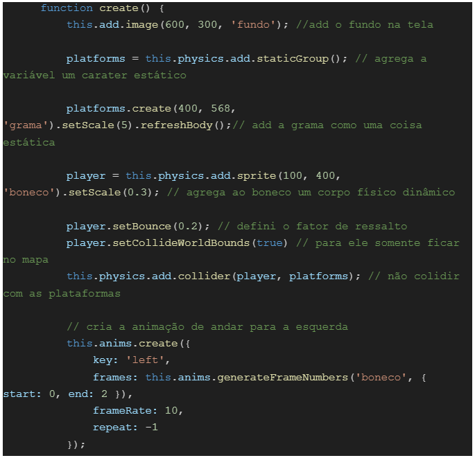
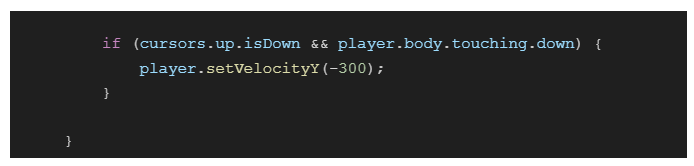

# GDD - Game Design Document - Módulo 1 - Inteli

<a href="https://inteli-college.github.io/2024-T0012-IN01-G05/">Link jogável</a>

<a href="https://youtu.be/Wxu8fuLhrx0">Link do Trailer do Jogo</a>

## BioDurk

#### Cecília Lima Coelho
#### João Victor Wandermurem de Oliveira
#### Kauan Massuia
#### Larissa Martins Pereira de Souza
#### Leonardo Souza Martins
#### Miguel da Silva Claret

## Sumário

[1. Introdução](#c1)

[2. Visão Geral do Jogo](#c2)

[3. Game Design](#c3)

[4. Desenvolvimento do jogo](#c4)

[5. Casos de Teste](#c5)

[6. Conclusões e trabalhos futuros](#c6)

[7. Referências](#c7)

[Anexos](#c8)

 

#  Lista de Figuras
 - Análise SWOT
 - 5 Forças de Porter
 - Canvas da Proposta de Valor do Projeto
 - Matriz de Risco do Projeto
 - Público Alvo do Projeto
 - Personagem Unilson
 - NPC Exclamação
 - Imagens Mapa
 - Imagem Puzzle
 - ConceptArt Telas do Jogo
 - ConceptArt Mapa do Jogo
 - ConceptArt Unilson
 - ConceptArt Pedaço de Papel
 - ConceptArt NPC Exclamação
 - Paleta de Cores
 - Gameflow
 - Print do Player andando para a direita
 - Print do Player andando para a esquerda
 - Print do Player pulando
 - Programação 1
 - Programação 2
 - Programação 3
 - Programação 4
 - Programação 5
 - Programação 6
 - Pulo
 - Print de Programação Sprint 2, parte 1
 - Print de Programação Sprint 2, parte 2
 - Unilson andando sprint 2
 - Print de Programação Sprint 2, parte 3
 - Print de Programação Sprint 2, parte 4
 - Print de Programação Sprint 2, parte 5
 - Print de Programação Sprint 2, parte 6
 - Print de Programação Sprint 2, speechbubble
 - Print de Programação Sprint 2, setasspeechbubble
 - Print das classes Monstro e NPC sendo utilizadas na Fase 1
 - Print das classe NPC e Balão
 - Interação com o NPC
 - Print da cena da missão
 - Intereção com o Monstro
 - Interação do player pegando pedaços do papel
 - Print da tela com o HUD
 - Abrindo o Livro
 - Cutscene
 - Tutorial
 - Fase e Conteúdo do Livro
 - Quiz Final
 - Escolha de Dificuldade
 - Tela de Pause
 - Checkpoint
 - Hud Nova
 - Hud livro nova

#  Lista de Tabelas
 - Tabela de Requisitos do Projeto
 - Trilha sonora
 - Inventário
 - Bestiário
 - Mecânicas do jogo
 - Casos de Teste
 - Playteste 1
 - Playteste 2
 - Playteste 3
 - Playteste 4
 - Playteste 5

# 1. Introdução
&nbsp;&nbsp;&nbsp;&nbsp;GGD ou Game Design Document é um documento desenvolvido para servir de mapa para o desenvolvimento e correções posteriores à publicação do jogo. Nele pontuaremos as partes mais relevantes para sua criação. O seguinte documento será feito ao decorrer das sprints, sendo atualizado semanalmente até o dia da entrega final para o melhor desenvolvimento do jogo. O jogo consiste em um projeto de gameficação do Onboarding da Unilever, tendo como principal objetivo passar os valores da empresa para o novo funcionário.
Dentro do primeiro tópico, a fim de entender a empresa, o cenário na qual ela está posicionada e público que buscamos atingir, será abordado:

 - Introdução;                                                                                                      
 - Escopo do Projeto;
 - Contexto da Indústria;
 - Análise SWOT;
 - 5 Forças de Porter;
 - Descrição da Solução Desenvolvida;
 - Proposta de Valor;
 - Matriz de risco e Sprints;
 - Requisitos do projeto;
 - Público-Alvo do projeto.

 &nbsp;&nbsp;&nbsp;&nbsp; Em síntese, este documento ofereceu uma visão abrangente e detalhada dos elementos fundamentais para o desenvolvimento do jogo de gamificação do Onboarding da Unilever. Desde a análise do contexto da indústria até a definição do público-alvo e da proposta de valor, cada tópico abordado forneceu insights valiosos para orientar o projeto. Com essa base sólida estabelecida, estamos prontos para avançar com confiança na criação de uma experiência envolvente e eficaz que transmita os valores da empresa aos novos funcionários de maneira significativa.

## 1.1. Escopo do Projeto
&nbsp;&nbsp;&nbsp;&nbsp;Diante da necessidade apresentada pela Unilever, acerca do aprimoramento do processo de onboarding de funcionários de TI, no qual todos devem participar de procedimentos, por vezes maçantes, que os levem a conhecer mais a empresa, identificamos uma solução. A proposta é definida pela criação de um jogo web cuja intenção é tornar o processo de onboarding da Unilever o mais leve e dinâmico possível. Ademais, a primeira impressão de um novo colaborador é de suma importância para a sua motivação dentro de uma empresa. Bem como, seu entendimento do negócio é fundamental para atribuir sentido às suas tarefas dentro do ambiente empresarial, reduzindo o turnover, e culminando no crescimento do negócio. Por isso, temos como proposta o UniBoarding, apresentando o universo Unilever de uma forma lúdica e, ainda assim, muito relevante.

### 1.1.1. Contexto da indústria

&nbsp;&nbsp;&nbsp;&nbsp;Nós do Instituto de Liderança e Tecnologia Inteli, com a Unilever, iniciamos um projeto de games para o onboarding. A Unilever, líder global em bens de consumo, com 400 marcas em 190 países diferentes, enfrenta uma indústria competitiva com Procter & Gamble e Nestlé. Seu modelo de negócio destaca-se pela inovação e sustentabilidade, com marcas naturais como Mãe Terra que tem faturado mais de R$100 milhões por ano  e Love Beauty and Planet que gerou €50.7 bilhões em vendas em 2020. Na América Latina, Brasil, México, Argentina e Colômbia são mercados-chave em cuidados pessoais e alimentos. A empresa adapta-se às demandas locais, mantendo qualidade e satisfação do cliente. Com marcas renomadas, a Unilever prospera com um lucro líquido de 6,49 bilhões de euros em 2023, enfrentando desafios e capitalizando oportunidades em um mercado dinâmico.

### 1.1.2. Análise SWOT
&nbsp;&nbsp;&nbsp;&nbsp;Segundo  Oliveira (2007, p.17),  planejamento  estratégico é importante porque direciona  a  empresa  ao  melhor  caminho  a  ser  seguido,  considerando  os  fatores  externos  e  internos,  de  modo  inovador  e diferenciado. Por isso, SWOT é uma sigla em inglês que representa: Strengths (Forças), Weaknesses (Fraquezas), Opportunities (Oportunidades) e Threats (Ameaças). Trata-se de uma análise que é construída baseado nos ambientes internos e externos de uma empresa e em que é possível fazer um planejamento estratégico das adaptações necessárias para a finalidade do negócio. As Forças (Strength), todos os recursos que diferenciam positivamente a empresa dos concorrentes (por exemplo: Tecnologia inovadora), e Fraquezas (Weakness), todas as limitações da empresa (por exemplo: custos elevados), revelam o ambiente interno. Já o ambiente externo refere às Oportunidades (Opportunities), possibilidades não exploradas, e as Ameaças (Threats), qualquer fator que atrapalha a finalidade de um negócio (por exemplo: mercado saturado ou concorrência oferecendo melhores preços). Logo, levando em consideração que estamos desenvolvendo um projeto para a Unilever, torna-se importante entender os fatores internos e externos dessa empresa.

Figura 1 - Análise SWOT

Fonte: Material produzido pelos autores (2024)

&nbsp;&nbsp;&nbsp;&nbsp;A empresa em questão é uma potência global em bens de consumo, e mantém um portfólio diversificado e lucrativo. Seu compromisso com a sustentabilidade e inovação é notável, impulsionando iniciativas como a campanha "Real Beauty". No entanto, sua dependência de regiões-chave e em distribuidores terceirizados expõe vulnerabilidades acerca das mudanças econômicas e preferências dos consumidores. O que nos leva a enxergar que há oportunidades em mercados emergentes, fusões e aquisições, e comércio eletrônico. Ainda que se enfrentem ameaças intensas de concorrência, flutuações econômicas, cambiais e complexidades regulatórias, destacando a necessidade de adaptação contínua para garantir o sucesso futuro.

&nbsp;&nbsp;&nbsp;&nbsp;Em conclusão, a análise SWOT realizada oferece uma visão abrangente dos fatores internos e externos que afetam a Unilever. Destacou-se a importância do compromisso da empresa com a sustentabilidade e inovação, ao mesmo tempo em que reconhecemos suas vulnerabilidades, como a dependência de regiões-chave e distribuidores terceirizados. Identificamos oportunidades promissoras, como a expansão para mercados emergentes e fusões estratégicas, enquanto enfrentamos ameaças como a intensa concorrência e flutuações econômicas. Essa análise serve como base essencial para o planejamento estratégico do projeto de gamificação do Onboarding da Unilever, permitindo-nos alavancar os pontos fortes da empresa e mitigar os desafios para alcançar o sucesso futuro.

### 1.1.3 Análise das 5 Forças de Porter
&nbsp;&nbsp;&nbsp;&nbsp;Segundo Michael Porter, “em qualquer indústria, nacional ou internacional, que produza um produto ou um serviço, as regras da concorrência estão personificadas em cinco forças: a entrada de novos concorrentes, a ameaça de substitutos, o poder de negociação dos compradores, o poder de negociação dos fornecedores, e a rivalidade entre os concorrentes existentes”. Por isso, a fim de entender como a Unilever está posicionada dentro da indústria à qual ela faz parte, fizemos a análise das 5 Forças de Porter dessa empresa.

Figura 2 - 5 Forças de Porter

Fonte: Material produzido pelos autores (2024)

#### Poder de barganha dos fornecedores

&nbsp;&nbsp;&nbsp;&nbsp;O poder de barganha dos fornecedores em relação à Unilever pode ser determinado como moderado, uma vez que a diversidade de opções de fornecedores para os segmentos dessa empresa é diversificada e a Unilever tem uma influência significativa no mercado. Exemplo disso são os fornecedores de embalagens que, por serem diversos, dão à Unilever a possibilidade de fazer negociações de preços e condições contratuais com maior margem. Nessa lógica, a Unilever poderia explorar mais essa vantagem competitiva em contratos de longo prazo, acordando fornecimentos estáveis em troca de preços competitivos

#### Ameaça de novos entrantes

&nbsp;&nbsp;&nbsp;&nbsp;As barreiras para novos entrantes tornam-se altas, visto que para adentrar esse mercado a nova empresa terá que lidar com competidores consolidados, como a própria Unilever e a Nestlé, por exemplo, canais de distribuição restritos e alta economia. Dessa forma, pode-se entender que o nível de ameaça para a Unilever é baixo. Nessa lógica, caso haja a entrada de novas empresas, é possível haver mudanças nos preços e possível diluição dos lucros para os participantes existentes. Entretanto, nenhuma dessas suposições pode ser levada em consideração, haja vista o nível de ameaça é baixo.
 

#### Ameaça de produtos substitutos

&nbsp;&nbsp;&nbsp;&nbsp;Sabendo-se que a Unilever é uma empresa endereçada na indústria de bens e consumo, deve-se ressaltar que por haver uma abundância significativa de opções para os consumidores dentro desse tipo de indústria, o nível de ameaça de produtos substitutos para os da Unilever é muito alto. Ademais, empresas como a Natura, Ypê e P&G possuem produtos que atingem a mesma finalidade dos da Unilever, principalmente no que tange cuidados pessoais, limpeza e higiene pessoal.Para combater essa situação, a Unilever tem investido consideravelmente em pesquisa e desenvolvimento (P&D),para inovar e melhorar seus produtos, e no fortalecimento da marca e lealdade dos seus clientes por meio de campanhas de marketing no meio digital.

#### Poder de barganha dos clientes

&nbsp;&nbsp;&nbsp;&nbsp;Mais uma vez, devido ao grande volume de produtos substitutos e às compras feitas pelos varejistas, há um aumento no poder de barganha dos clientes. Isso ocorre porque neste setor não existem grandes diferenciações entre os produtos da mesma categoria. Por exemplo, no caso da pasta de dente, outras grandes empresas oferecem produtos muito similares aos da Unilever, conferindo aos clientes uma ampla variedade de escolha. Dessa forma, a Unilever poderia desenvolver um programa de fidelidade que ofereça recompensas, brindes ou descontos para os clientes frequentes, com o objetivo de aumentar a fidelidade do consumidor

#### Rivalidade entre os concorrentes

&nbsp;&nbsp;&nbsp;&nbsp;A rivalidade entre concorrentes se acirra uma vez que para cada produto existe um concorrente, muitas vezes, direto. Isto é, a margem de diferenciação entre as empresas é curta, logo os produtos são percebidos como relativamente similares. No caso da Unilever, tem-se como exemplo de concorrentes diretos, os da Dove que são marcas como a Nivea, Olay e Neutrogena, o que aponta o nível de rivalidade que essa tem que lidar dentro do mercado que está inserida, sendo percebido como alto. Para superar seus concorrentes a Unilever busca ativamente parcerias estratégicas e aquisições para acessar novos mercados e tecnologias, isso permite à empresa expandir rapidamente seu portfólio com marcas inovadoras e emergentes. Além disso, enquanto a Unilever opera globalmente, ela se esforça para manter um forte foco local, adaptando seus produtos e estratégias de marketing para atender às preferências e necessidades específicas dos consumidores em diferentes regiões.

&nbsp;&nbsp;&nbsp;&nbsp;Podemos utilizar as 5 Forças de Porter para identificar os principais desafios e oportunidades que a Unilever enfrenta em seu ambiente competitivo. A análise revela um poder de barganha moderado dos fornecedores, alta barreira para novos entrantes, ameaça substancial de produtos substitutos, alto poder de barganha dos clientes e rivalidade intensa entre os concorrentes. Esses insights são fundamentais para orientar estratégias futuras da empresa, permitindo que ela se adapte às condições do mercado e maximize seu potencial de crescimento e sucesso.

### 1.1.4. Descrição da Solução Desenvolvida

&nbsp;&nbsp;&nbsp;&nbsp;Para descrever a solução que desenvolvemos, devemos partir do desafio enfrentado pela Unilever que é: a falta de atratividade na apresentação da empresa para os funcionários recém-contratados de TI, resultando em um baixo engajamento com o conteúdo disponibilizado durante o processo de Onboarding. De acordo com o site oficial da Unilever e o documento TAPI (Termo de Abertura do Projeto), a Unilever é uma multinacional britânica com mais de 400 marcas, comprometida com a inovação, sustentabilidade, diversidade e inclusão. A empresa se envolve em projetos de alto impacto social visando transformar vidas. Atuando em diversos segmentos, como beleza e bem-estar, cuidado pessoal, cuidados domiciliares, nutrição e sorvete.

&nbsp;&nbsp;&nbsp;&nbsp;Para melhorar a absorção das informações pela nova equipe, propõe-se a implementação de um jogo digital no processo de Onboarding. Neste jogo, os recém-contratados de TI irão coletar fragmentos de papel, que posteriormente irão servir para montar páginas de um livro que conterá informações sobre os produtos, marcas, mercados, slogans de marcas e políticas de sustentabilidade da Unilever. Ao final, terão acesso à intranet da Unilever por meio de um HUB gamificado de conteúdo, onde poderão aprofundar seu conhecimento sobre a cultura híbrida da empresa.

&nbsp;&nbsp;&nbsp;&nbsp;A solução visa aumentar o engajamento dos novos funcionários com os conteúdos do Onboarding, envolvê-los com a companhia por meio de aspirações e facilitar o acesso às informações. Para avaliar o sucesso do jogo digital no processo de Onboarding, serão considerados os seguintes critérios: Taxa de engajamento com o público, compreensão das informações da Unilever e diminuição na rotatividade de funcionários. Esses critérios poderão ser mensurados por meio de feedbacks dos participantes, comparação com taxas de rotatividade anteriores e análise do número de participantes e tempo dedicado ao jogo.

&nbsp;&nbsp;&nbsp;&nbsp;Em conclusão, a Unilever enfrenta desafios específicos relacionados à falta de atratividade na apresentação da empresa para os funcionários recém-contratados de TI e ao baixo engajamento durante o processo de Onboarding. A proposta de implementação de um jogo digital visa não apenas melhorar a absorção das informações, mas também aumentar o engajamento dos novos funcionários, envolvê-los com a cultura da empresa e facilitar o acesso às informações essenciais. Os critérios estabelecidos para avaliar o sucesso do jogo são fundamentais para garantir a eficácia da solução proposta, proporcionando uma experiência de integração mais eficiente e satisfatória para os colaboradores.

### 1.1.5. Proposta de Valor
&nbsp;&nbsp;&nbsp;&nbsp;A Propostas de Valor é uma ferramenta visual que mapeia os valores de um produto alinhado com as necessidades dos clientes. Os critérios utilizados para o produto solução:
- Produto e Serviços
- Aliviam Dores
- Criadores de Ganho

&nbsp;&nbsp;&nbsp;&nbsp;Já os critérios avaliados para as necessidades do cliente são:
- Ganhos
- Tarefas do Cliente
- Dores
  

Figura 3 - Canvas da Proposta de Valor do Projeto

Fonte: Material produzido pelos autores (2024)

&nbsp;&nbsp;&nbsp;&nbsp;Em resumo, a Proposta de Valor desenvolvida para o projeto proporciona uma visualização clara dos valores do produto, alinhados com as necessidades dos clientes. Os critérios considerados para o produto solução, como Produto e Serviços, Alívio de Dores e Criação de Ganho, garantem que o produto atenda às expectativas e ofereça benefícios tangíveis aos usuários. Ao mesmo tempo, os critérios avaliados para as necessidades dos clientes, incluindo Ganhos, Tarefas do Cliente e Dores, garantem que a solução aborde de forma eficaz os desafios e oportunidades identificados no processo de Onboarding da Unilever. O Canvas da Proposta de Valor servirá como um guia essencial para o desenvolvimento e aprimoramento contínuo do produto, garantindo sua relevância e eficácia ao longo do tempo.

### 1.1.6. Matriz de Riscos
&nbsp;&nbsp;&nbsp;&nbsp;A Matriz de Riscos é uma ferramenta utilizada para analisar e avaliar, por meio de critérios, todos os fatos que possam prejudicar o desenvolvimento do jogo. Ao organizar os possíveis riscos em uma tabela, a empresa tem uma visão geral de todas as vulnerabilidades do projeto e assim priorizando a solução dos problemas mais graves. Os critérios são:
- Probabilidade de Ocorrência: é a chance de um fato acontecer
- Impacto: mede o potencial que um acontecimento pode paralisar o projeto
- Prioridade: é a combinação da Probabilidade de Ocorrência e Impacto que determina qual problema é mais grave.

Figura 4 - Matriz de Risco do Projeto

Fonte: Material produzido pelos autores (2024)

#### Baixa:

- **Problemas de acessibilidade:**  o impacto desse problema seria um jogo que poderia eventualmente excluir determinados usuários - poderíamos evitar essa dificuldade já iniciando nossos estudos sobre acessibilidade e desde o começo garantir que mecânicas estejam presentes no jogo para não ficar de última hora, pois se trata de uma prioridade;

- **Exclusão de funcionários com dificuldades tecnológicas:** o impacto desse problema seria fazer um jogo complexo demais e pouco interativo - poderíamos enfrentar essa dificuldade facilmente pois nosso jogo tem como base ter um desing e mecânicas simples que garantem um jogo simples e efetivo; 

- **Falta de comprometimento dos membros da equipe:** esse problema poderia trazer um atraso considerável para a construção do jogo, e eventualmente nos deixar atrás do nosso mvp -essa dificuldade pode ser evitada com uma conversa séria com os participantes que eventualmente estejam desanimados;

- **Falta de colaboração da empresa cliente:** o impacto desse problema seria um jogo que não atende ao pedido pela empresa, pois o mesmo não ficou claro - o problema pode ser evitado realizando as perguntas corretas em todos os momentos que temos acesso a uma troca de ideias com a empresa;

#### Média:

- **Falta de organização na produção do game:** o impacto desse problema pode trazer um atraso muito grande para o projeto, pois sem organização o tempo não será bem utilizado - O problema pode ser evitado seguindo um modelo de organização como o "Kanban";

- **Má comunicação entre os membros da equipe:** esse problema poderia trazer um atraso considerável para a construção do jogo, e eventualmente nos deixar atrás do nosso mvp - essa dificuldade poderia ser evitada seguindo um modelo de comunicação saudável, onde os problemas do grupo e avanços são sempre comunicados;

- **Desalinhamento com a cultura da empresa:** esse problema poderia criar um jogo que não se encaixa com a empresa cliente e que não poderia ser utilizado pela mesma - essa dificuldade pode ser evitada realizando uma pesquisa bem aprofundada nos valores da empresa;

#### Alta:

- **Funcionário não se interessar pelo jogo:**  esse problema poderia acabar com o objetivo do jogo que é justamente interessar o funcionário pelo onboarding - esse problema pode ser evitado realizando pesquisas de público alvo;

- **Bug ou falha técnica no jogo:** esse problema poderia acabar com a experiência do jogo para o usuário possivelmente impedindo o jogo de sequer iniciar - esse problema poderia ser evitado com a realização de muitos testes minuciosos para garantir o funcionamento do jogo;

- **Grupo sem experiência na linguagem do projeto:** esse problema poderia impedir que o jogo fosse sequer desenvolvido - essa dificuldade pode ser evitada garantindo que todos os membros do grupo façam um estudo aprofundado;

- **Prometer um jogo para além do escopo do projeto:** esse problema pode trazer inconsistências para as expectativas da empresa cliente, e fazer com que ela se decepciona com o resultado diferente do que foi prometido - essa dificuldade pode ser evitada garantindo que tudo que for passado para o cliente seja 100% factível;

&nbsp;&nbsp;&nbsp;&nbsp;Em conclusão, a Matriz de Riscos proporciona uma análise abrangente das potenciais vulnerabilidades que podem afetar o desenvolvimento do jogo de gamificação do Onboarding da Unilever. Ao classificar os riscos com base na probabilidade de ocorrência e no impacto, podemos priorizar a resolução dos problemas mais críticos. Desde questões como problemas de acessibilidade e falta de colaboração da empresa cliente até desafios como bugs técnicos e falta de experiência na linguagem do projeto, a matriz destaca áreas essenciais que demandam atenção. Adotar medidas preventivas, como estudos de acessibilidade e comunicação eficaz, ajudará a mitigar esses riscos e garantir o sucesso do projeto.

## 1.2. Requisitos do Projeto
&nbsp;&nbsp;&nbsp;&nbsp;Os requisitos do projetos são as condições que o projeto deve cumprir para conseguir alcançar seu objetivo final. Os requisitos pedidos pela Unilever para atingir sua meta final são:
Tabela de Requisitos

Tabela 2 - Tabela de Requisitos do Projeto

\# | Requisito  
--- | ---
1 | Jogo Desktop Web
2 | Apresentar as 5 esferas da empresa
3 | Medir a absorção de conteúdo pelo funcionário
4 | Abordar sobre as ações sociais da instituição
5 | Hub de direcionamento para as trilhas do Onboarding da empresa

Fonte: Material produzido pelos autores (2024)

&nbsp;&nbsp;&nbsp;&nbsp;Em conclusão, os requisitos do projeto estabelecidos pela Unilever delineiam as condições necessárias para alcançar com sucesso o objetivo final de gamificar o processo de Onboarding da empresa. Esses requisitos incluem a criação de um jogo desktop web que apresente as cinco esferas da empresa, meça a absorção de conteúdo pelos funcionários, aborde as ações sociais da instituição e forneça um hub de direcionamento para as trilhas do Onboarding. Esses critérios são essenciais para garantir que o jogo atenda às expectativas da Unilever e proporcione uma experiência de integração eficaz e envolvente para os novos funcionários.

## 1.3. Público-alvo do Projeto

&nbsp;&nbsp;&nbsp;&nbsp;Um público-alvo é um grupo específico de pessoas no qual uma empresa se baseia para realizar uma série de tomadas de decisão, seja para o marketing, seja para a criação ou aprimoramento de novos produtos ou soluções. Ele é definido com base em uma série de dados, como idade, comportamentos, gostos, gênero, entre outros. Com base em um questionário enviado à empresa Unilever, o público-alvo do jogo desenvolvido pelo grupo Biodurk pode ser definido como homens e mulheres com idade predominante entre 24 e 45 anos, sendo essa a média realizada entre as idades dos funcionários, que trabalham em sua maioria na área de TI, com interesse em jogos de ação, aventura e estratégia, e que preferem predominantemente jogar em computadores ou consoles, além de valorizarem informações claras sobre a estrutura da empresa, as áreas e suas funções, sendo essas as principais dicas para o Onboarding. Tendo como base o questionário enviado pelos alunos do Inteli, contendo perguntas relacionadas a dados demográficos e a gostos pessoais dos colaboradores da Unilever entre os dias 21 e 27 de fevereiro de 2024, todas as afirmações acima puderam ser confirmadas e usadas para o desenvolvimento do público-alvo.

Figura 5 - Público Alvo do Projeto

Fonte: Material produzido pelos autores (2024)

# 2. Visão Geral do Jogo 

&nbsp;&nbsp;&nbsp;&nbsp;Esta seção apresenta as finalidades e os aspectos do jogo, separados em dois subtópicos: Objetivos do Jogo e Características do Jogo, sendo este último dividido em mais cinco tópicos: Gênero do Jogo, Plataforma do Jogo, Número de Jogadores, Títulos Semelhantes e Inspirações, e Tempo Estimado de Jogo.

## 2.1. Objetivos do Jogo 

&nbsp;&nbsp;&nbsp;&nbsp;O jogo desenvolvido pelo grupo Biodurk tem um objetivo: conectar os novos funcionários de TI à Unilever e suas marcas, tornando o processo de Onboarding mais atrativo e divertido. No jogo, o jogador terá a missão de recuperar as páginas do Livro Unilever, que contém informações essenciais sobre a empresa e links importantes para o processo de integração.
Para completar essa missão, o jogador deve explorar o mapa, coletando fragmentos de página espalhados pelas plataformas. Cada fragmento coletado contribui para a montagem de uma página do livro. Quando uma quantidade suficiente de fragmentos é reunida, a página é montada na tela, revelando os links para acessar o documento de Onboarding. O jogador pode visitar esses links sempre que desejar, pois o personagem principal estará carregando o livro.
Quando todas as páginas forem coletadas, o jogador é desafiado a se dirigir a um prédio da Unilever. Lá, ele responderá a um questionário baseado nos links lidos, recebendo um feedback sobre seu aproveitamento. 

## 2.2. Características do Jogo 
&nbsp;&nbsp;&nbsp;&nbsp;No universo dos jogos, a fim de ter uma maior imersão e uma experiência enriquecedora, deve-se definir características fundamentais capazes de revelar a essência do jogo ao player. Para isso, em relação ao jogo desenvolvido, tem-se nessa seção a definição desde o gênero, até inspirações e tempo estimado de jogo, tendo um detalhamento das propriedades do projeto. O gênero do jogo define o tipo de experiência que os jogadores podem esperar, podendo variar desde ação, aventura, RPG, plataforma, estratégia, simulação, até jogos de quebra-cabeça. Enquanto ter uma estimativa do tempo necessário para concluir o jogo é importante para os jogadores planejarem suas sessões de jogo. Isso pode variar desd1.e algumas horas para jogos mais curtos até dezenas de horas para jogos mais longos e complexos.

### 2.2.1. Gênero do Jogo 

&nbsp;&nbsp;&nbsp;&nbsp;O jogo UniBoarding pertence ao gênero de estilo plataforma com um enredo voltado à ação. O estilo de plataforma nasceu nos primórdios dos games e se caracteriza por ter um personagem se movendo horizontalmente por um cenário podendo pular sobre plataformas pelo cenário, geralmente com o objetivo de chegar ao final de cada fase ou nível. O desafio principal desses jogos é superar obstáculos como lacunas, inimigos e armadilhas, muitas vezes exigindo que o jogador salte de plataforma em plataforma de forma habilidosa e precisa. Esses jogos apresentam uma jogabilidade rápida e desafiadora, onde o tempo de reação e a habilidade de controle do jogador são fundamentais. Além disso, frequentemente incluem objetos de coleta, como moedas, que podem ajudar o jogador em sua jornada. A aventura aparece no jogo, uma vez que a atmosfera é designada à exploração com uma narrativa envolvente e que aponta para a resolução de um problema. 

### 2.2.2. Plataforma do Jogo 

&nbsp;&nbsp;&nbsp;&nbsp;O UniBoarding é um jogo web para dispositivos desktop. Além disso, pensando em um jogo de baixo código, requisitado pela Unilever, utilizamos o Phaser, um framework de código aberto. A escolha dessa tecnologia não apenas facilita a execução do jogo, mas também elimina a necessidade de plugins, proporcionando uma experiência de jogo mais fluida e acessível para todos os jogadores.

### 2.2.3. Número de jogadores 

&nbsp;&nbsp;&nbsp;&nbsp;Desenvolvido para aprimorar o processo de integração de novos funcionários da área de TI da Unilever, o jogo UniBoarding oferece uma abordagem dinâmica e envolvente. Projetado especificamente como um jogo para um jogador, ele proporciona uma experiência individualizada

### 2.2.4. Títulos semelhantes e inspirações 

&nbsp;&nbsp;&nbsp;&nbsp;O jogo UniBoarding foi desenvolvido dentro do gênero plataforma, contendo fragmentos de papel a serem coletados e inimigos a serem combatidos. UniBoarding foi inspirado em jogos como Super Mario Bros, Super Mombo Quest, Pokémon FireRed e Sonic the Hedgehog, contemplando parte de suas mecânicas, como coletar moedas, pular em cima dos inimigos e a velocidade característica do Sonic, além das ideias de design envolvendo um mundo mais colorido.

### 2.2.5. Tempo estimado de jogo 

&nbsp;&nbsp;&nbsp;&nbsp;O jogo pode ser completado em um tempo médio de 22 minutos, variando de acordo com a dificuldade escolhida: 19 minutos no modo fácil e 35 minutos no modo difícil, considerando a passagem por todas as fases e a conclusão do quiz final. Cada fase exige um tempo diferente para ser concluída. No modo fácil, a fase 1 e 2 requerem 2 minutos e a fase 3, de 3 minutos. No modo difícil, o tempo para completar a fase 1 é de 6 minutos, para a Fase 2, 7 minutos, e para a Fase 3, 8 minutos. Além disso, o quiz final tem uma duração média de 5 minutos, e o tempo destinado à leitura dos materiais e links externos fornecidos é, em média, de 7 minutos.

# 3. Game Design 
&nbsp;&nbsp;&nbsp;&nbsp;Segundo Chandler (2012), o processo de produção de um jogo inicia com a definição do seu conceito inicial (Game Design) e termina com a criação de uma versão final do jogo, sendo que várias etapas acontecem entre esses dois pontos. Seguindo essa definição, a fim de estabelecer o design do nosso jogo criamos a base do mesmo definindo o seu enredo, personagens, mundo, até regras e mecânicas. 

## 3.1. Enredo do Jogo 

&nbsp;&nbsp;&nbsp;&nbsp;O enredo do jogo é responsável por designar o início, meio e fim da trajetória que será experimentada pelo jogador. Nesse sentido, é a partir dessa trama que o jogador será estimulado a perpassar por todos os momentos da narrativa até atingir um objetivo.

&nbsp;&nbsp;&nbsp;&nbsp;Diante dessa perspectiva, o enredo do nosso projeto acontecerá em uma cidade com bastante verde para representar o mundo ideal Unilever, atrelando o avanço com a sustentabilidade. O jogo girará em torno de uma grande problemática: o sumiço do livro com todas as fórmulas secretas dos produtos e informações confidenciais da empresa. Com isso, é atribuído ao personagem controlável, a missão de resgatar esse livro. O personagem será a figura de um “U” antropomórfico, ou seja, com características humanas. Este foi nomeado como Unilson, a fim de ter uma relação com o nome da empresa parceira: Unilever.

&nbsp;&nbsp;&nbsp;&nbsp;Para tanto, o jogador, através desse personagem, terá que cumprir o desafio de coletar uma quantidade mínima de pedaços do livro pelo mapa. Essas páginas do livro farão o jogador completar o desafio de encontrá-lo, e além disso, dará ao jogador informações importantes sobre a Unilever, o  que dará suporte a ele para completar uma missão final. Nessa missão, cujo objetivo é provar que ele está pronto para fazer parte do corpo empresarial da Unilever, este terá que demonstrar tudo que aprendeu no decorrer da jornada em um teste final.

&nbsp;&nbsp;&nbsp;&nbsp;O teste conterá perguntas sobre os assuntos tratados no decorrer do jogo, e servirão como uma forma de observar quanto esse jogador aprendeu, bem como, de acordo com esse resultado ele poderá ter ou não acesso ao prédio da UniOps. Logo, esse prédio será como o estágio final do jogo, tendo, portanto, um encerramento, e um feedback sobre o desenvolvimento do jogador durante o processo. 

&nbsp;&nbsp;&nbsp;&nbsp;Em resumo, o enredo do jogo cria uma história envolvente em torno do personagem Unilson, que busca recuperar um livro importante para a empresa Unilever. Ao longo da jornada, os jogadores aprendem os valores da empresa. O teste final avalia o conhecimento adquirido, determinando o acesso ao prédio da UniOps. Essa estrutura oferece uma experiência divertida e educativa, culminando em um desfecho gratificante e informativo para os jogadores.

## 3.2. Personagens 

&nbsp;&nbsp;&nbsp;&nbsp;Personagens, de acordo com Fullerton (2008), são os agentes que impulsionam a narrativa de um jogo. São essenciais para engajar os jogadores na experiência de jogo, atuando como os principais condutores da história. Eles são os elementos do jogo que seguem as regras e executam virtualmente as ações dos jogadores ou são controlados diretamente pelo jogo. Logo, podem ou não ser controlados pelo jogador.

### 3.2.1. Controláveis

&nbsp;&nbsp;&nbsp;&nbsp; Personagens controláveis em jogos, conforme conceituados por Comparato, representam os protagonistas centrais da narrativa, assumindo o papel de heróis e conduzindo o jogador através das experiências e desafios do jogo. Esses personagens são os avatares do jogador, como observado por Novak, servindo como pontos de identificação e conexão emocional para os jogadores dentro do universo do jogo. Essa relação estabelecida entre jogador e personagem controlável é essencial para a imersão e a interatividade, permitindo que os jogadores experimentem o mundo virtual, tomem decisões e alcancem objetivos enquanto exploram a narrativa e a mecânica do jogo.

GIF 1 - Personagem Unilson

Fonte: Material produzido pelos autores (2024)

&nbsp;&nbsp;&nbsp;&nbsp;O personagem controlável, bem como, protagonista do UniBoarding é o Unilson, uma representação personificada da letra "U". Ele recebeu esse nome e formato para remeter à Unilever, ademais, até mesmo sua cor foi definida pensando na identidade dessa organização. Assim, pode-se entender que a estética dele foi estabelecida como uma forma de dar vida à logo da empresa parceira, com uma aparência muito divertida. 

### 3.2.2. Non-Playable Characters (NPC)

&nbsp;&nbsp;&nbsp;&nbsp;Segundo Cayres, esses são personagens controlados pela máquina, que podem ser os oponentes do Personagem Jogável ou os coadjuvantes da história, ajudando o jogador durante a jornada. Eles podem agir independentemente do jogador ou em repostas às suas ações. Logo, para introduzir e fazer o chamado ao jogador trazendo informações acerca da missão que ele irá receber no jogo, tornou-se necessário a criação de um Non-Playable Characters. 

Figura 6 - NPC Exclamação

Fonte: Material produzido pelos autores (2024)

&nbsp;&nbsp;&nbsp;&nbsp;Esse NPC, mais uma vez, com características humanas, recebeu a forma de um ponto de exclamação, visto que esse ícone é constantemente utilizado no universo dos jogos como um indicador de alerta, missões ou objetivos. Da mesma forma, a cor vermelha foi utilizada a fim de trazer a sensação de urgência. Desse modo, levando em consideração a função dada a esse NPC, caracterizá-lo dessa forma foi a alternativa escolhida.

### 3.2.3. Diversidade e Representatividade dos Personagens

&nbsp;&nbsp;&nbsp;&nbsp;Buscando um alinhamento com a proposta direcionada no TAPI, a qual ressalta a importância de representar os personagens de forma a seguir conceitos relacionados a representatividade e diversidade, buscamos uma forma de defini-los para que fossem abrangentes o suficiente para atender qualquer público. Trazer esses conceitos no jogo se tornam importantes à medida que entendemos o quão diverso é a sociedade a qual estamos inseridos.

&nbsp;&nbsp;&nbsp;&nbsp;Ademais, deve-se ressaltar que a população brasileira é o resultado de uma grande mistura de culturas e características físicas de diversas partes do mundo. Segundo o IBGE, o Brasil tem 203 milhões de habitantes distribuídos entre indígenas, portugueses, africanos, árabes, italianos, espanhóis, alemães, japoneses e muitos outros povos que ajudaram a formar a população brasileira. Além do mais, no Censo de 2022, foi contabilizado que cerca de 45,3% (92,1 milhões de pessoas) se declararam pardas, 43,5% (88,2 milhões de pessoas) se declararam brancas, 10,2% (20,6 milhões) se declararam pretas, 0,6% das pessoas (1,2 milhão) se declararam indígenas e 0,4% (850,1 mil) se declararam amarelas. Com isso, evidencia-se a pluralidade de indivíduos com características diversas que estariam em busca de identificação com os nossos personagens.

&nbsp;&nbsp;&nbsp;&nbsp;Por isso, a fim de evitar quaisquer estereótipos, tanto o Personagem Controlável, Unilson, como o NPC, exclamação, assumiram formas de caracteres.  Essa decisão intencional foi tomada visando proporcionar aos jogadores uma identificação mais fluida com os personagens, independentemente de suas origens étnicas, gênero ou características físicas. Assim, promove-se uma experiência de jogo inclusiva e acessível a todos os públicos enfatizando a importância disso no mundo dos jogos eletrônicos.

## 3.3. Mundo do jogo 

&nbsp;&nbsp;&nbsp;&nbsp;O mundo do jogo consiste em um ambiente fictício onde se passará todo o game, ambientando a jornada no player. Aliás, fora do escopo dos jogos, isto é, em tudo que envolve uma narrativa, também é necessário um espaço. Nesse sentido, o mundo do jogo se configura, portanto, como o espaço da narrativa do game. Nele, são criados, através dos elementos que o compõem, a atmosfera do game, seja por meio do clima, trilha sonora, mecânicas ou navegação.

### 3.3.1. Locações Principais e/ou Mapas 

&nbsp;&nbsp;&nbsp;&nbsp;O jogo apresenta um mapa com tiles (elementos gráficos que constroem um mapa interativo), formando um ambiente tranquilo com céu azul, nuvens, gramados e terra. Inclui uma fábrica da Unilever e níveis desafiadores que exigem habilidades como saltar, com o prédio da UniOps como referência.

Figura 7 - Imagens Mapa

Fonte: Material produzido pelos autores (2024)

 &nbsp;&nbsp;&nbsp;&nbsp;Com esse mapa, esperamos oferecer a combinação de um ambiente tranquilo com elementos desafiadores que criam uma experiência de jogo envolvente e divertida para os jogadores. Espera-se que os jogadores se sintam imersos neste mundo virtual, explorando os cenários enquanto enfrentam os desafios apresentados.

### 3.3.2. Navegação pelo mundo 

&nbsp;&nbsp;&nbsp;&nbsp;A navegação do personagem é controlada pelas mecânicas de movimento implementadas. No nosso jogo, o jogador utiliza as setas do teclado: a seta esquerda movimenta o personagem para a esquerda, a seta direita para a direita, e a seta para cima faz o personagem pular. Essas mecânicas são consistentes em todo o mapa do jogo. 

Figura 8 - Imagem Puzzle

Fonte: Material produzido pelos autores (2024)

&nbsp;&nbsp;&nbsp;&nbsp;Durante a exploração do mapa, o jogador encontrará fragmentos de páginas que precisam ser coletados para avançar no objetivo do jogo. No entanto, há uma seção específica logo após a fábrica que requer outros tipos de habilidades para ser navegada com sucesso: o quiz. Nele, será necessária a aplicação dos conhecimentos absorvidos durante o game.

### 3.3.3. Condições climáticas e temporais 

&nbsp;&nbsp;&nbsp;&nbsp;
A fim de oferecer uma experiência mais envolvente, bem como, para uma maior representatividade do nosso meio ambiente, incluímos uma variedade de condições climáticas. Ademais, essas condições contribuem também para a temática das cenas, visto que um ambiente ensolarado remete a tranquilidade, enquanto a chuva remete a dificuldade. As condições climáticas do jogo são: 

- **Dia ensolarado:** Durante o dia ensolarado, os jogadores são recebidos por um céu claro. Esta condição climática é ideal para explorar o cenário e realizar tarefas que exigem precisão e foco.

- **Noite com trovoadas:** À medida que as fases passam, o céu se torna escuro e tempestuoso, com nuvens pesadas. Esta condição climática adiciona um elemento de desafio estratégico, exigindo que os jogadores se adaptem 
  
### 3.3.4. Concept Art 
&nbsp;&nbsp;&nbsp;&nbsp;O termo Concept Art consiste em desenhos iniciais dos cenários, personagens ou objetos que estarão presentes no jogo, sendo esses rascunhos, na maioria das vezes, feitos à mão, tendo como objetivo elaborar as representações dos elementos do projeto e suas possíveis formas. Então com base na nossa narrativa produzimos os seguintes Concept Art:

Figura 9 - ConceptArt Telas do Jogo

Fonte: Material produzido pelos autores (2024)

&nbsp;&nbsp;&nbsp;&nbsp;Enquanto ConceptArt das telas de início e game over, pensamos em algo que remetesse justamente a um mundo lúdico da Unilever. Por isso, adicionamos como esboço nuvens e o nome do próprio jogo. Bem como, posicionamos botões que são fundamentalmente os elementos mais importantes dessas telas.

Figura 10 - ConceptArt Mapa do Jogo

Fonte: Material produzido pelos autores (2024)

&nbsp;&nbsp;&nbsp;&nbsp;Para o mapa do jogo, na ConceptArt buscamos definir as partes cruciais que iriam compor o mundo, sendo essas: O tutorial com interação com NPC, um vislumbre do edifício da Unilever ainda fechado, os desafios com as plataformas, coleta dos papéis e chegada a UniOps. Esses momentos do jogo estão divididos dentre as fases de forma diferente, todavia a essência desse esboço se manteve.

Figura 11 - ConceptArt Unilson

Fonte: Material produzido pelos autores (2024)

&nbsp;&nbsp;&nbsp;&nbsp;O processo de criação do personagem principal e controlável do UniBoarding surgiu através da ideia de personificar a letra U, de Unilever. Assim, fomos adicionando elementos como olhos, boca, pernas e braços a essa letra a fim de compor um personagem animado, surgindo o chamado Unilson.

Figura 12 - ConceptArt Pedaço de Papel

Fonte: Material produzido pelos autores (2024)

&nbsp;&nbsp;&nbsp;&nbsp;O Pedaço de Papel é a representação das partes do livro secreto da Unilever que foram espalhadas no mapa pelo Sr. Poluição. Logo, esse elemento precisava se parecer com um papel rasgado e ao mesmo tempo, aparentar um item coletavel. Portanto, seguindo essas duas propostas desenhamos esse elemento.

Figura 13 - ConceptArt NPC Exclamação

Fonte: Material produzido pelos autores (2024)

&nbsp;&nbsp;&nbsp;&nbsp;O esboço do NPC Exclamação segue a ideia de que, no universo dos jogos existe um símbolo que serve como um indicador de alerta, missões ou objetivos: O ponto de exclamação. Nesse sentido, buscamos representar esse símbolo com características humanas tornando-o um personagem.

&nbsp;&nbsp;&nbsp;&nbsp;E assim, a fim de aprimorar essas ideias constituímos a seguinte a paleta de cores:

Figura 14 - Paleta de Cores

Fonte: Material produzido pelos autores (2024)

&nbsp;&nbsp;&nbsp;&nbsp;A paleta de cores foi dividida em duas partes: personagens e cenário. No que tange os personagens, ela permeia principalmente pelo vermelho e o azul. O azul é característico da Unilever, enquanto o vermelho foi introduzido no NPC e possui um senso de urgência presente na narrativa. Já o cenário, possui inicialmente cores claras, que remetem a felicidade compondo um mundo feliz.

### 3.3.5. Trilha sonora 

&nbsp;&nbsp;&nbsp;&nbsp;Segundo Schäfer, a trilha sonora de um jogo deve ser  suscita a emoção, ou seja, que apela à emotividade do jogador, devendo acompanhar esse em relação ao cenário e aos inimigos enfrentados. Seguindo essa definição, buscamos com a trilha sonora de UniBoarding, montar uma atmosfera calma, coerente com o mundo apresentado. Bem como, a música foi escolhida para que o jogador pudesse focar na mecânica e também no conteúdo que será passado. 

&nbsp;&nbsp;&nbsp;&nbsp;Por isso, com o passar das fases, quando o jogador chegar ao "combate final" onde acontecerá o quiz, em que as perguntas deverão ser respondidas corretamente para eliminar o chefão, teremos uma música com mais ação. Esse música foi escolhida, pensando justamente em intensificar essa atmosfera de tensão e dificuldade, incorporando elementos como ritmos acelerados e batidas pulsantes para manter o jogador totalmente imerso na experiência.

Tabela 3 - Trilha sonora

\# | Título | Ocorrência | Autoria
--- | --- | --- | ---
1 | Coleta de papel | Quando o jogador coleta o papel |<a href="https://pixabay.com/pt/sound-effects/paper-collect-1-186598/">floraphonic</a>
2 | Música tema | Jogo inteiro | <a href="https://pixabay.com/pt/music/ambiente-wondrous-waters-119518/">ID 29811401</a>
3 | Vida perdida | Quando o jogador leva dano |Pixabay
4 | Abrir livro | Quando o jogador abrir o livro |<a href="https://pixabay.com/pt/sound-effects/handle-paper-foley-2-172689/">floraphonic</a>
5 | Pulo | Quando o jogador pular | <a href="https://pixabay.com/pt/sound-effects/cartoon-jump-6462/">Pixabay</a>
6 | Passos | Quando o jogador está andando | <a href="https://pixabay.com/pt/sound-effects/running-in-grass-6237/">Pixabay</a>
7 | Música luta | Quiz final | <a href="https://pixabay.com/pt/music/jogos-de-video-battle-time-178551/">Lesiakower</a>
8 | Ataque Unilson | Quando o jogador acerta uma questão | <a href="https://pixabay.com/pt/sound-effects/charged-laser-7125/">Pixabay</a>
9 | Ataque Sr. Poluição | Quando o jogador erra uma questão | <a href="https://pixabay.com/pt/sound-effects/slimey-97605/">Pixabay</a>
10 | Som CutScene | Enquanto passa a CutScene | <a href="https://pixabay.com/pt/sound-effects/pad-high-tension-and-suspense-background-filler-162365/">Fronbondi_Skegs</a>
11| Som Checkpoint | Quando o jogador passsa pelo checkpoint | <a href="https://pixabay.com/pt/sound-effects/airport-checkin-soundeffect02-100081/">Pixabay</a>
12| Som de Vitória | Quando o player atingi 80% ou mais de aproveitamento no quiz | <a href="https://pixabay.com/pt/sound-effects/success-fanfare-trumpets-6185/">Pixabay</a>
13| Som de Derrota | Quando o player atingi menos de 80% de aproveitamento no quiz |<a href="https://pixabay.com/pt/sound-effects/brass-fail-1-a-185074/">Floraphonic</a>
14| Som de Chuva | Som ambiente da fase 04 |<a href="https://pixabay.com/pt/sound-effects/soft-rain-ambient-111154/">SoundsForYou</a>

Fonte: Material produzido pelos autores (2024)

&nbsp;&nbsp;&nbsp;&nbsp;Em síntese, a trilha sonora de um jogo desempenha um papel crucial na experiência do jogador, influenciando suas emoções e interações com o mundo virtual apresentado. Além disso, nos preocupamos também em incorporar efeitos sonoros ao game capazes de torná-lo mais realista. No caso de UniBoarding, seguimos essa abordagem ao selecionar cuidadosamente cada faixa musical para criar uma atmosfera coesa e envolvente.

## 3.4. Inventário e Bestiário 

&nbsp;&nbsp;&nbsp;&nbsp;O inventário consiste, basicamente em uma área onde ocorre o armazenamento de itens coletados e gerenciáveis pelo jogador durante o jogo. No Minecraft, por exemplo, ele inclui armas, armaduras, poções, materiais de criação e muito mais. Já o Bestiário, seria um catálogo das várias entidades, como inimigos e NPCs, que fazem parte do mundo do jogo. Dentro da narrativa do UniBoarding, estão inclusos no inventário e bestiário alguns itens e entidades que dão maior coerência à história do jogo.

### 3.4.1. Inventário

&nbsp;&nbsp;&nbsp;&nbsp;Levando em consideração que no inventário ficam os itens coletáveis, dentro do universo do nosso jogo teremos os chamados "pedaços de papel". Esse item é crucial para o bom funcionamento do game, pois a conclusão das fases depende da coleta desses itens, isto é, ao coletar uma quantidade definida de papéis pelo mapa, uma página do livro perdida é desbloqueada, permitindo avançar para a próxima fase.

Tabela 4 - Inventário 

\# | Item |  | Como obter | Função | Efeito sonoro
--- | --- | --- | --- | --- | ---
1 | pedaços de papel |  | deve ser coletada ao passar por desafios de plataforma por todo o mapa | ao ser acumulado 20 pedaços para a fase difícil ou 10 no modo fácil, uma folha completa com muitas informações será desbloqueada | som de pergaminho

Fonte: Material produzido pelos autores (2024)

&nbsp;&nbsp;&nbsp;&nbsp;Este item desempenha um papel crucial na trama, pois é fundamental para resolver o conflito central. Quando o vilão rouba o livro de segredos da Unilever e espalha seus pedaços pelo mapa, cabe ao jogador coletá-los não apenas para restaurar o livro, mas também para desvendar os mistérios ocultos que o livro contém, revelando assim informações importantes para o desfecho da história.

### 3.4.2. Bestiário

&nbsp;&nbsp;&nbsp;&nbsp;Enquanto parte do bestiário, temos no nosso jogo duas entidades que permeiam toda a trajetória do Unilson, são eles: A Garrafa Pet e o Sr. Poluição. Representando monstros e vilões esses são encarregados de trazer desafios ao jogador, elevando o nível de dificuldade do game. 

Tabela 5 - Bestiário 

\# | Inimigo |  | Ocorrências | Função | Impacto | Efeito sonoro
--- | --- | --- | --- | --- | --- | ---
2 | Garrafa Pet (Amil)|  | A partir da fase 1 |Move-se horizontalmente da direita e para esquerda com velocidade constante.| se encostar, o personagem perde 1 ponto de vida | Não possui
3 | Sr. Poluição|  | Fase Final | Batalha com o Unilson e de acordo com a resposta dada a questão do formulário pode atacar ou receber um ataque| É um vilão, logo seu ataque pode levar o Unilson ao game over  | Som de gosma (ataque)

Fonte: Material produzido pelos autores (2024)

&nbsp;&nbsp;&nbsp;&nbsp;A Garrafa Pet, personificando a ameaça dos resíduos plásticos e a poluição ambiental resultante do descarte inadequado, serve como um lembrete vívido dos impactos negativos das atividades humanas no meio ambiente. Sua presença constante ao longo do jogo não apenas desafia o jogador, mas também o convida a refletir sobre sua própria relação com o consumo e o descarte responsável de materiais.

&nbsp;&nbsp;&nbsp;&nbsp;Por outro lado, o Sr. Poluição personifica as consequências mais amplas da degradação ambiental, representando não apenas a poluição tangível, mas também os efeitos nefastos sobre ecossistemas inteiros e comunidades. Sua presença sombria  destaca a urgência de enfrentar os desafios ambientais globais, incentivando os jogadores a considerar a importância da sustentabilidade e da proteção do meio ambiente não apenas dentro do jogo, mas também em suas próprias vidas.

&nbsp;&nbsp;&nbsp;&nbsp;Assim, entende-se que os vilões foram escolhidos para representar problemas reais que são enfrentados pela Unilever. Logo, a fim de trazer mais consciência e sustentabilidade, esses percalços ambientais devem ser enfrentados também dentro do jogo para perpassar ao novo colaborador essa missão que existe dentro da empresa.

## 3.5. Gameflow (Diagrama de cenas) 

&nbsp;&nbsp;&nbsp;&nbsp;De acordo com a Teoria do Flow (Mihaly Csikszentmihalyi 1996), o estado de fluxo ou fluidez, é configurado como um estado psicológico no qual uma pessoa se encontra envolvida em uma atividade, perdendo a noção do tempo e direcionando sua atenção para a tarefa em questão. Essa condição não apenas reflete uma experiência imersiva, mas também é caracterizada por um aumento do desempenho e satisfação do indivíduo. Em concordância com esse definição, percebe-se que no contexto de games, ter essa fluidez é imprescindível para o rendimento do jogador. Logo, a fim de proporcionar esse estado para os nossos players desenvolvemos um Diagrama de Cenas capaz de direcionar um fluxo harmonioso de ações cuja dificuldade e as habilidade se mantivessem equilibradas.

Figura 15 - Gameflow

Fonte: Material produzido pelos autores (2024)

&nbsp;&nbsp;&nbsp;&nbsp;Esse Game Flow descreve como será a jornada do jogador, delimitando o início, meio e fim da trajetória, bem como, os seus reinícios quando necessários. Com isso, ao iniciar o UniBoarding clicando no botão "Começar", o jogador será direcionado para a tela que servirá como um tutorial do funcionamento das mecânicas básicas, para que ele entenda o funcionamento das teclas e os comandos necessários para cada movimento. Logo após, começará de fato o enredo, sendo entregue a ele, por meio de um NPC, uma missão: encontrar o livro perdido da Unilever.

&nbsp;&nbsp;&nbsp;&nbsp;Em seguida, ele deverá cumprir desafios, escalando plataformas, para coletar fragmentos do livro que darão a ele informações importantes, se ele conseguir, ele passa para a próxima etapa, se não, ele retorna para o início. Já a próxima etapa, é a mais importante, uma vez que, nessa parte, ele terá que utilizar tudo que absorveu de conteúdos dos fragmentos para responder um formulário final. Por fim, de acordo com o resultado das respostas do formulário, ele poderá encerrar o jogo, retornar para o início do formulário, tendo uma segunda chance, ou retornar para o início do jogo, tendo que rever todo o conteúdo.

## 3.6. Regras do jogo

&nbsp;&nbsp;&nbsp;&nbsp; As regras do jogo são um conjunto de instruções ou diretrizes estabelecidas para governar a conduta e as interações dos participantes durante a prática de um determinado jogo ou atividade competitiva. São essas que delimitam as ações possíveis para o jogador e estabelecem limites de interação com os elementos do jogo.

&nbsp;&nbsp;&nbsp;&nbsp;Como regra, para ter um bom entendimento do jogo, deve-se interagir com o NPC para receber a missão, que será recolher todos os fragmentos de uma página. Vale lembrar que durante o percurso de recolhimento de fragmentos, inimigos estarão vagando pelo mapa podendo gerar dano ao seu personagem, aqui surge mais uma regra: não encostar no monstro.

&nbsp;&nbsp;&nbsp;&nbsp;Assim, que todos os fragmentos forem coletados, uma folha com as informações da empresa será criado, uma vez que lido, o jogador irá ter uma página completa e assim se sucede por outras fases até chegar no chefão final. Nessa fase ele responderá um quiz que irá ditar se o jogador entendeu o conteúdo das páginas ou não. Com o quiz sendo completado, será medido a assertividade das respostas, se for maior do que 80% você terá concluído a missão e se acertar de 50% a 80% você irá refazer o quiz e se acertar abaixo de 50% irá começar o jogo novamente do zero.

## 3.7. Mecânicas do jogo

&nbsp;&nbsp;&nbsp;&nbsp;Todos os jogos são compostos por 3 elementos: mechanics (mecânicas), dynamics (dinâmicas) e aesthetics (estética). Estes são definidos pela estrutura conceitual do MDA. Segundo Robin Hunicke, Marc LeBlanc, Robert Zubek, as mecânicas são  "as várias ações, comportamentos e mecanismos de controle adquiridos pelo jogador dentro do contexto do jogo". No UniBoarding, as mecânicas  são essenciais para criar desafios, diversão e engajamento aos jogadores, influenciando diretamente a jogabilidade e a dinâmica da experiência de jogo.

Tabela 6 - Mecânicas do jogo

\# | Comandos | Ação de cada tecla
--- | --- | ---
⇦ | Seta para esquerda | Indica que o personagem vai se mover para a esquerda
⇨ | Seta para direita | Indica que o personagem vai se mover para a direita
⇑ | Seta para cima | Servirá para o personagem pular
▬ | Tecla “espaço”| Servirá para o personagem pular
↵ | Tecla “Enter” | Será utilizado para a interação com o NPC e para passar para a próxima mensagem durante a interação
𖤂 | Clique do Mouse | Irá servir para assinalar qual alternativa do quiz está correta
P | Tecla "P" | irá abrir e fechar o livro de conteúdos da Unilever

Fonte: Material produzido pelos autores (2024)

&nbsp;&nbsp;&nbsp;&nbsp;O UniBoarding, em termos de mecânica, por ter sido desenvolvido no formato 2D para desktop, terá as movimentações em 3 sentidos, sendo eles: baixo, esquerda e direita. Esses movimentos, por sua vez, serão ocasionados através do acionamento de teclas. Bem como, sua interação com NPC, ocorrerá ao clicar em "Enter". Vale ressaltar que o jogador também utilizará o mouse para clicar e escolher qual afirmação é verdadeira durante o quiz final do jogo.

# 4. Desenvolvimento do Jogo

## 4.1. Desenvolvimento preliminar do jogo 

&nbsp;&nbsp;&nbsp;&nbsp;  Neste estágio inicial do desenvolvimento do jogo de gamificação do Onboarding da Unilever, estamos dando os primeiros passos cruciais na concepção e planejamento do jogo. O desenvolvimento preliminar abrange os principais aspectos do jogo, como sua mecânica, narrativa, interface e funcionalidades básicas. Este estágio é fundamental para estabelecer uma visão clara do que o jogo será e como ele irá funcionar, fornecendo uma estrutura sólida para o trabalho subsequente. Ao delinear os objetivos e diretrizes iniciais, estamos dando os primeiros passos para criar uma experiência de Onboarding envolvente e eficaz, alinhada com os valores e metas da Unilever.

&nbsp;&nbsp;&nbsp;&nbsp;Durante a primeira fase do jogo foi desenvolvido o personagem (logo da Unilever personificado), o cenário inicial (fundo azul com nuvens e o chão de grama), e os movimentos do player que são: 

&nbsp;&nbsp;&nbsp;&nbsp;Para frente (Direita)

Figura 16 - Print do Player andando para a direita 

Fonte: Material produzido pelos autores (2024)

&nbsp;&nbsp;&nbsp;&nbsp;Para trás (Esquerda)

Figura 17 - Print do Player andando para a esquerda

Fonte: Material produzido pelos autores (2024)

&nbsp;&nbsp;&nbsp;&nbsp;Para cima (Pulo)

Figura 18 - Print do Player pulando

Fonte: Material produzido pelos autores (2024)

&nbsp;&nbsp;&nbsp;&nbsp;Para realizar isso utilizamos a linguagem Javascript e os seguintes comandos,todos comentados em verde, correspondem a atribuição dos elementos no jogo, criação de cenário, e movimentação do personagem:

&nbsp;&nbsp;&nbsp;&nbsp;Variáveis (valores) utilizadas:

Figura 19 - Programação 1

Fonte: Material produzido pelos autores (2024)

&nbsp;&nbsp;&nbsp;&nbsp;Atribuição dos elementos:

Figura 20 - Programação 2

Fonte: Material produzido pelos autores (2024)

&nbsp;&nbsp;&nbsp;&nbsp;Criação do Cenário e propriedades físicas:

Figura 21 - Programação 3

Fonte: Material produzido pelos autores (2024)

Figura 22 - Programação 4

Fonte: Material produzido pelos autores (2024)

&nbsp;&nbsp;&nbsp;&nbsp;Movimentação do Personagem (dinâmica):

Figura 23 - Programação 5

Fonte: Material produzido pelos autores (2024)

Figura 24 - Programação 6

Fonte: Material produzido pelos autores (2024)

&nbsp;&nbsp;&nbsp;&nbsp;Assim foi concluída a primeira fase do projeto que será utilizado como base para a elaboração completa do jogo.
    

## 4.2. Desenvolvimento básico do jogo 

&nbsp;&nbsp;&nbsp;&nbsp;O desenvolvimento básico do jogo refere-se à fase inicial em que são estabelecidos os fundamentos essenciais do projeto de gamificação. Isso inclui a definição dos principais elementos do jogo, como mecânicas de jogo, narrativa, interface do usuário e funcionalidades básicas. Nesta etapa, o foco principal é criar uma estrutura sólida que sirva como base para o desenvolvimento futuro, sem adicionar elementos complexos ou recursos avançados. O objetivo é garantir que o jogo seja viável e funcional, atendendo aos requisitos básicos do projeto e proporcionando uma experiência inicialmente satisfatória para os usuários.

&nbsp;&nbsp;&nbsp;&nbsp;Adicionamos o pulo dinâmico do personagem (pulo para direita, esquerda e idle) e também melhorar a forma como ele pula, desde as pernas dobrando até o braço indo para cima para pegar impulso.

- **Dificuldades:** foram encontradas dificuldades para animar completamente os movimentos de pulo do personagem, pois todas as primeiras tentativas fizeram o personagem congelar ou voar. Depois de muitas tentativas, o objetivo foi alcançado.

GIF 2 - Pulo

Fonte: Material produzido pelos autores (2024)

Figura 25 - Print de Programação Sprint 2, parte 1

Fonte: Material produzido pelos autores (2024)

Figura 26 - Print de Programação Sprint 2, parte 2

Fonte: Material produzido pelos autores (2024)

 Câmera do jogo segue o personagem mantendo-o centralizado;
 Tela de início com botão de start funcional; 
 Tela de final com botão de restart funcional;
 Capacidade de coletar itens no chão que carregam a pontuação;
 Barra de pontuação funcional que coleta os itens:

GIF 3 - Unilson andando sprint 2

Fonte: Material produzido pelos autores (2024)

Figura 27 - Print de Programação Sprint 2, parte 3

Fonte: Material produzido pelos autores (2024)

Figura 28 - Print de Programação Sprint 2, parte 4

Fonte: Material produzido pelos autores (2024)

Figura 29 - Print de Programação Sprint 2, parte 5

Fonte: Material produzido pelos autores (2024)

Figura 30 - Print de Programação Sprint 2, parte 6

Fonte: Material produzido pelos autores (2024)

&nbsp;&nbsp;&nbsp;&nbsp;Nessa sprint fizemos a adição de um NPC com um balão de fala para poder existir uma interação do jogador com o jogo e consequentemente melhorar a experiência do colaborador com a empresa já logo de início.

 Dificuldades: A dificuldade foi conseguir fazer com que o NPC ficasse atrás do personagem principal e o balão possui diversas edições que quando levadas em conta acabam sendo complicadas como cor, formato, cor da sombra, cor da escrita, tamanho da escrita etc...

Figura 31 - Print de Programação Sprint 2, speechbubble

Fonte: Material produzido pelos autores (2024)

Figura 32 - Print de Programação Sprint 2, setasspeechbubble

Fonte: Material produzido pelos autores (2024)

&nbsp;&nbsp;&nbsp;&nbsp; Em conclusão, o desenvolvimento básico do jogo de gamificação do Onboarding da Unilever avançou significativamente durante esta etapa. Os principais elementos do jogo foram estabelecidos, incluindo mecânicas de jogo como o pulo dinâmico do personagem e a interação com NPCs por meio de balões de fala. Apesar das dificuldades encontradas, como a animação dos movimentos de pulo do personagem e a implementação do NPC com o balão de fala, a equipe conseguiu superar os desafios e alcançar os objetivos estabelecidos para esta fase do desenvolvimento. Com a adição de funcionalidades essenciais, como a coleta de itens, a pontuação e as telas de início e final, o jogo está progredindo na direção certa para proporcionar uma experiência inicialmente satisfatória aos usuários. Este progresso é fundamental para garantir que o jogo seja viável e funcional, atendendo aos requisitos básicos do projeto e preparando-o para fases subsequentes de desenvolvimento e refinamento.

## 4.3. Desenvolvimento intermediário do jogo 

**Renovação no mapa do jogo**

&nbsp;&nbsp;&nbsp;&nbsp;Durante essa Sprint, fizemos uma completa renovação no mapa do jogo. Agora, a jornada do Unilson, será ambientada por uma cidade ecológica com muitas plataformas e lugares perigosos para o player.

**Refatoração do código para POO**

&nbsp;&nbsp;&nbsp;&nbsp;A Refatoração é o processo de alterar um software de uma maneira que não mude o seu comportamento externo e ainda melhore a sua estrutura interna. Logo, a fim de melhorar a estrutura interna do nosso código, fizemos uma refatoração para Programação Orientada a Objetos (POO), que consiste em um paradigma de programação que permite a criação de códigos reutilizáveis.

Figura 33 - Print das classes Monstro e NPC sendo utilizadas na Fase 1

Fonte: Material produzido pelos autores (2024)

Figura 34 - Print das classe NPC e Balão

Fonte: Material produzido pelos autores (2024)

**Criação da Cena Tutorial e Interação com NPC**

&nbsp;&nbsp;&nbsp;&nbsp;Diante da demanda de deixar o jogo mais contextualizado e intuitivo, criamos uma cena tutorial. Essa cena será responsável por ensinar ao jogador as mecânicas básicas do jogo. Da mesma forma, para melhorar a compreensão da história do jogo inserimos um NPC, esse passará ao jogador as mensagens necessárias para que ele tenha uma jornada com propósito no game.

GIF 4 - Interação com o NPC

Fonte: Material produzido pelos autores (2024)

**Criação da Cena Missão**

&nbsp;&nbsp;&nbsp;&nbsp;Para seguir a narrativa que estruturamos para o jogo, vimos a necessidade de criar uma cena para entregar ao player a missão que ele precisará cumprir.

Figura 35 - Print da cena da missão

Fonte: Material produzido pelos autores (2024)

**Criação da Fase 1**

&nbsp;&nbsp;&nbsp;&nbsp;Seguindo a ideia de dividir o jogo em fases, iniciamos a fase 1. Nela, o jogador terá uma interação com o NPC, sendo encaminhado a explorar o mapa e recolher os papéis espalhados por ele. A fase é finalizada quando o player consegue coletar todos os papéis e acessa, assim, a primeira página do livro.

**Criação e interação do monstro**

 GIF 5 - Interação com o Monstro

Fonte: Material produzido pelos autores (2024)

**Coleta de papéis**

GIF 6 - Interação do player pegando pedaços do papel

Fonte: Material produzido pelos autores (2024)

**HUD**

&nbsp;&nbsp;&nbsp;&nbsp;Nessa Sprint conseguimos fazer o desenvolvimento parcial da HUD, ou seja, das informações que irão aparecer na tela do jogo, como contagem de papéis coletados e a barra de vida.

Figura 36 - Print da tela com o HUD

Fonte: Material produzido pelos autores (2024)

**Criação do Livro de Segredos**

&nbsp;&nbsp;&nbsp;&nbsp;Nessa Sprint implementamos no jogo também o livro de segredos para que ao completar a coleta de papéis em cada fase, a página completa correspondente apareça nesse livro.

GIF 7 - Abrindo o Livro

Fonte: Material produzido pelos autores (2024)

&nbsp;&nbsp;&nbsp;&nbsp;Com esses elementos adicionados ao jogo, podemos ter uma visão ainda mais clara sobre como a visão da Unilever estará presente ao longo do game.

## 4.4. Desenvolvimento final do MVP 

&nbsp;&nbsp;&nbsp;&nbsp;Segundo Eric Ries, MVP (Minimum Viable Product) é definido como “a versão do produto que permite uma volta completa do ciclo construir-medir-aprender, com o mínimo de esforço e o menor tempo de desenvolvimento”. Sendo assim, partindo do conceito de MVP estabelecemos como objetivo final para o nosso jogo a entrega de uma versão inicial do projeto de modo que pudéssemos ter a completude desse ciclo e ainda, cuja entrega fosse educativa e dinâmica de forma contextualizada. Para isso, percebemos a necessidade de desenvolver alguns elementos muito importantes que pudessem contribuir para uma narrativa envolvente e com traços de aventura. Esses elementos são:

**Cutscene de Contextualização:**

&nbsp;&nbsp;&nbsp;&nbsp;Desenvolvemos uma cutscene inicial para estabelecer o contexto e introduzir os jogadores à história e ao ambiente do jogo. Esta cutscene fornece o cenário para a experiência que os jogadores estarão prestes a embarcar, criando assim uma conexão emocional e um objetivo com o jogo desde o início. 

GIF 8 - Cutscene

Fonte: Material produzido pelos autores (2024)

**Tutorial Dinâmico:**

&nbsp;&nbsp;&nbsp;&nbsp;Implementamos um tutorial interativo e envolvente que ensina aos jogadores os controles básicos, mecânicas de jogo e qualquer informação relevante necessária para que os jogadores possam se familiarizar rapidamente com a jogabilidade. O objetivo é garantir que os jogadores possam começar a aproveitar o jogo sem sentir-se sobrecarregados por informações complexas.

Figura 37 - Tutorial

Fonte: Material produzido pelos autores (2024)

**Fases Desafiadoras e Educativas**

&nbsp;&nbsp;&nbsp;&nbsp;Criamos três fases distintas que oferecem desafios progressivamente mais difíceis, mas ao mesmo tempo proporcionam oportunidades de aprendizado. Cada fase foi projetada para fornecer aos jogadores informações educativas sobre a empresa parceira, que posteriormente serão aplicadas de maneira prática dentro do contexto do jogo. Isso garante que os jogadores não apenas se divirtam, mas também absorvam o conhecimento pré-definido enquanto jogam.

Figura 38 - Fase e Conteúdo do Livro

Fonte: Material produzido pelos autores (2024)

**Quiz Final**

&nbsp;&nbsp;&nbsp;&nbsp;Implementamos um quiz final que testa o conhecimento adquirido pelos jogadores ao longo do jogo. Este quiz servirá como uma oportunidade para os jogadores demonstrarem o que aprenderam durante a experiência de jogo e fornecerá feedback valioso sobre a eficácia do jogo como uma ferramenta educativa.

Figura 39 - Quiz Final

Fonte: Material produzido pelos autores (2024)

**Aprimoramentos**

&nbsp;&nbsp;&nbsp;&nbsp;Para aprimoramentos futuros do jogo, são possíveis uma série de implementações. Ademais, por se tratar de um jogo educativo, pode haver uma expansão nos conteúdos que são transmitidos ao decorrer do jogo, mais informações sobre a empresa parceira, conceitos relevantes relacionados ao tema do jogo ou até mesmo incorporar elementos de diferentes áreas para enriquecer a experiência educativa. Bem como, pode-se agregar opções de personalização, a fim de oferecer uma experiência mais diversificada. Para isso, podem ser utilizadas, por exemplo, ferramentas de personalizar os personagens, desbloquear conquistas, ganhar recompensas e acompanhar o progresso ao longo do tempo.
&nbsp;&nbsp;&nbsp;&nbsp;Outro aprimoramento, muito importante, seria a integração de feedback dos jogadores que pode ser feita a partir de duas perspectivas: uma coleta de impressões sobre o jogo e um retorno sobre a quantidade de acertos do "Quiz Final". Ambas podem agregar fortemente ao aprimoramento do jogo e na experiência do usuário.
&nbsp;&nbsp;&nbsp;&nbsp;Por último, levando em consideração a diversidade de dispositivos e plataformas de jogo existentes, para aumentar a base de jogadores e impacto, pode-se expandir o game para outras plataformas.

**Dificuldades**

&nbsp;&nbsp;&nbsp;&nbsp;As dificuldades do grupo para o desenvolvimento do jogo giraram em torno, principalmente, da programação e da adaptação com a metodologia Scrum. Isso se deu essencialmente pelo fato de que, o grupo de modo integral, nunca tinha tido um contato significativo com ambos os tópicos, logo tornou-se mais desafiador.

&nbsp;&nbsp;&nbsp;&nbsp;Na programação podemos observar uma grande evolução de todos os membros da equipe, proporcional à dedicação. Bem como, quanto à metodologia Scrum, que segundo Fonseca (2009) consiste em "times trabalhando como
uma unidade altamente integrada com cada membro desempenhando um papel bem definido e o time inteiro focando num único objetivo", tivemos que aprender as rotinas desse conceito para aplicar essa metodologia e agilizar nossas entregas.

&nbsp;&nbsp;&nbsp;&nbsp;Logo, conclui-se que esses processos de dificuldades nos impulsionaram a aprimorar nossas habilidades quanto individuais, como também do grupo. Além disso, a familiarização com os princípios do Scrum proporcionou uma estrutura eficaz para coordenar as atividades e manter o foco no objetivo final. Bem como, ter essa primeira experiência com programação foi enriquecedor, ainda mais sabendo que um desenvolvedor deve ter técnicas sólidas e um aprendizado contínuo.

## 4.5. Revisão do MVP

&nbsp;&nbsp;&nbsp;&nbsp;Como parte do contínuo processo de refinamento do nosso jogo, implementamos uma série de melhorias significativas. Entre elas, destacam-se a introdução de diferentes níveis de dificuldade, a inclusão de um menu de pausa, a implementação de checkpoints estratégicos e aprimoramentos no design da HUD de vida, do livro e da tela de conclusão do jogo. Essas adições desempenharam um papel fundamental na elevação da dinâmica e da estética do jogo, garantindo uma experiência mais envolvente e gratificante para os jogadores.

**Graus de dificuldade**

&nbsp;&nbsp;&nbsp;&nbsp;Implementamos diferentes graus de dificuldade, permitindo que os jogadores escolham o nível de desafio que melhor se adequa às suas habilidades e preferências. Isso não apenas amplia a acessibilidade do jogo, mas também adiciona camadas de profundidade à experiência, garantindo que jogadores de todos os níveis possam desfrutar do jogo de maneira gratificante.

Figura 40 - Escolha de Dificuldade

Fonte: Material produzido pelos autores (2024)

**Menu de pause**

&nbsp;&nbsp;&nbsp;&nbsp;Além disso, adicionamos um menu de pausa, proporcionando aos jogadores a conveniência de interromper o jogo temporariamente, sem comprometer o progresso ou a imersão. Essa funcionalidade não só promove uma jogabilidade mais flexível, mas também demonstra nosso compromisso em oferecer uma experiência de usuário fluida e intuitiva.

Figura 41 - Tela de Pause

Fonte: Material produzido pelos autores (2024)

**Implementação de checkpoints**

&nbsp;&nbsp;&nbsp;&nbsp;A introdução de checkpoints representa outro marco significativo em nosso processo de refinamento. Esses pontos de salvamento estrategicamente posicionados não só facilitam a progressão dos jogadores, mas também reduzem a frustração associada a perdas de progresso. Dessa forma, garantimos uma experiência mais fluida e envolvente, incentivando os jogadores a explorar e experimentar livremente o mundo do jogo.

Figura 42 - Checkpoint

Fonte: Material produzido pelos autores (2024)

**Aprimoramentos de Design**

&nbsp;&nbsp;&nbsp;&nbsp;Além disso, dedicamos especial atenção aos elementos de design da HUD (Heads-Up Display), do livro e da tela de conclusão do jogo. Refinamos sua estética e funcionalidade para garantir uma experiência visualmente atraente e intuitiva. A HUD de vida, em particular, foi aprimorada para fornecer informações claras e precisas sobre o estado do jogador, enquanto o livro e a tela de conclusão foram redesenhados para proporcionar uma narrativa coesa e envolvente.

Figura 43 - Hud Nova

Fonte: Material produzido pelos autores (2024)

Figura 44 - Hud livro nova

Fonte: Material produzido pelos autores (2024)

&nbsp;&nbsp;&nbsp;&nbsp;Em suma, a introdução de diferentes níveis de dificuldade, um menu de pausa conveniente, checkpoints estratégicos e aprimoramentos no design da HUD, do livro e da tela de conclusão contribuem significativamente para a qualidade geral da experiência de jogo. Estamos confiantes de que essas adições não apenas elevam a dinâmica e a estética do jogo, mas também garantem uma experiência mais envolvente e gratificante para os jogadores, independentemente de seu nível de habilidade ou preferências pessoais.

# 5. Testes 

&nbsp;&nbsp;&nbsp;&nbsp;Os testes desempenham um papel importante no desenvolvimento de jogos, pois nos ajudam a garantir uma experiência mais imersiva para os jogadores. Ao realizar os Casos de Teste e os Testes de Jogabilidade com os colaboradores da Unilever, conseguimos identificar e corrigir problemas de usabilidade, bugs e falhas de design que podem comprometer a qualidade do jogo. Além disso, esses testes nos permitem entender melhor como os jogadores interagem com o jogo, suas preferências e os desafios que enfrentam, o que nos possibilita ajustar e melhorar a experiência de jogo.

&nbsp;&nbsp;&nbsp;&nbsp;Também observamos que os testes de jogabilidade são essenciais para desenvolver narrativas envolventes e mecânicas de jogo equilibradas. Ao avaliar a resposta dos jogadores durante os testes, podemos garantir que a história seja cativante e que as mecânicas de jogo sejam intuitivas e desafiadoras na medida certa. Assim, os testes de jogabilidade não apenas garantem a qualidade técnica do jogo, mas também contribuem para criar uma experiência de jogo mais satisfatória e envolvente para os jogadores.

## 5.1. Casos de Teste

&nbsp;&nbsp;&nbsp;&nbsp;Os casos de teste são fundamentais para garantir que um jogo funcione conforme o esperado. No contexto do UniBoarding, realizamos uma bateria abrangente de testes para avaliar diferentes aspectos do jogo. Ao seguir esse processo, pudemos identificar e corrigir qualquer falha ou inconsistência, garantindo que o UniBoarding oferecesse uma experiência sem problemas para os usuários.

&nbsp;&nbsp;&nbsp;&nbsp;Cada caso de teste foi planejado e executado, visando abordar áreas críticas do jogo e verificar se todas as funcionalidades estavam operando conforme o esperado. Ao dedicar atenção aos detalhes em todos os aspectos do teste, acreditamos que poderemos garantir que o jogo atenda às expectativas dos jogadores e ofereça momentos de diversão sem interrupções.

Tabela 7 - Casos de Teste

\# | pré-condição | descrição do teste | pós-condição 
--- | --- | --- | --- 
1 |  | Iniciar o jogo | Aparecer a animação da tela inicial e o a habilidade de apertar o botão de play
2 | Estar na cena 1 (tela inicial)| Apertar o botão jogar | Mudar para a cena principal (game)
3 | Estar  em qualqer cena depois da tela incial | Apertar tecla por tecla de movimentação, as setas e o espaço | O personagem deve andar para 3 sentidos: direita, esquerda e para cima
4 | Estar em qualquer cena que não seja a tutorial | Personagem encostar no papelzinho | Papelzinho sumir da tela, e somar um ponto na contagem de papelzinhos coletados
5| Estar na cena com npc | Aparição do npc na tela | Npc1 aparecer na tela com o "enter" flutuante
6| Estar na cena com npc | Apertar a tecla "enter" | O personagem vai interagir com o npc e vai aparecer a hud de fala
7| Estar em qualquer cena que não seja a cena 1 (tela inicial) ou no Livro| Apertar tecla P | Abrir o Livro de segredos da Unilever na tela
8| Estar em qualquer cena que não seja a cena 1 (tela inicial) ou no Livro | Ter colisão espinhos | Perder uma vida e voltar para o começo da fase
9| Estar em qualquer cena que não seja a cena 1 (tela inicial) ou no Livro | Ter colisão com a água | Perder uma vida e voltar para o começo da fase
10| Estar em qualquer cena que não seja a cena 1 (tela inicial) ou no Livro | Ter colisão com o monstro | Perder uma vida e voltar para o começo da fase
11| Estar em qualquer cena que não seja a cena 1 (tela inicial) ou no Livro | Perder todas as 5 vidas | Iniciar o jogo no tutorial
12| Estar no Livro de segredos da Unilever | Apertar tecla P | Fechar o livro de segredos da Unilever e voltar para a fase que estava
13| Estar no Livro de segredos da Unilever | Ter coletado 20 pedaços de papel| Aparecer o primeiro texto e link na tela
14| Estar no Livro de segredos da Unilever | Ter coletado 40 pedaços de papel| Aparecer o segundo texto e link na tela
15| Estar no Livro de segredos da Unilever | Ter coletado 60 pedaços de papel| Aparecer o terceiro texto e link na tela
16| Estar no Livro de segredos da Unilever | Clicar no Link | Player ser redirecionado para o site de aprendizagem da Unilever 
17| Estar no Livro de segredos da Unilever | Clicar no Link | A imagem do quarto ao lado alterar para deixar o quarto mais completo
18| Estar no Quiz Final | Acertar a questão | Iniciar a animação do Unilson atacando
19| Estar no Quiz Final | Errar a questão | Iniciar a animação do Sr. Poluição atacando
20| Estar no Quiz Final | Acertar mais que 80% das questões | Iniciar a tela final de vencedor
21| Estar no Quiz Final | Acertar entre 50% e 80% das questões | Iniciar a tela de perdedor e reiniciar o quiz
22| Estar no Quiz Final | Acertar menos que 50% das questões | Inciar a tela de perdedor e reiniciar o jogo

Fonte: Material produzido pelos autores (2024)

&nbsp;&nbsp;&nbsp;&nbsp;Portanto, os casos de teste são uma parte essencial do processo de desenvolvimento de jogos, pois garantem que cada aspecto do jogo seja avaliado. Ao aplicar casos de teste precisos, pode-se ter confiança de que o jogo funcionará conforme o esperado, proporcionando uma experiência satisfatória aos jogadores. Dessa forma, a implementação e execução eficazes de casos de teste não apenas garantem a qualidade do jogo, mas também contribuem significativamente para a satisfação do usuário e o sucesso do produto final.

## 5.2. Testes de jogabilidade

&nbsp;&nbsp;&nbsp;&nbsp;Os testes de jogabilidade, visam avaliar a experiência do usuário enquanto interage com o jogo. Os testes de jogabilidade do UniBoarding foram realizados por 5 funcionários da Unilever, predominantemente da área da tecnologia, com uma faixa etária de 37 anos, em média, sendo esses 4 mulheres e 1 homem, a partir desses tivemos uma amostra do nosso público-alvo. Os testes foram realizados no dia 27 de março de 2024, de forma online, por meio de reuniões no Teams. Durante essas reuniões, solicitávamos ao testador que compartilhasse sua tela, iniciasse o jogo e, enquanto jogava, desse feedback sobre o que estava observando e compreendendo do jogo. Fomos anotando tudo o que ele dizia durante o teste. Após a conclusão do jogo, fizemos algumas perguntas, tais como:

- Quantos anos ele tinha?
- Já teve alguma experiência com jogos?
- Qual seria sua nota para o jogo, em uma escala de 0 a 10?
- O que ele gostou no jogo?
- O que não gostou no jogo?
- O que poderíamos mudar no jogo?

&nbsp;&nbsp;&nbsp;&nbsp;Os testes de jogabilidade do UniBoarding, conduzidos por 5 funcionários da Unilever com diferentes idades, revelaram uma abordagem inclusiva. A metodologia online via Teams permitiu feedbacks em tempo real, enquanto as perguntas pós-teste ofereceram insights valiosos sobre a experiência do usuário. A análise desses dados pode direcionar melhorias no jogo para garantir uma experiência mais satisfatória e envolvente para o público-alvo.

### 5.2.1 Registros de testes

&nbsp;&nbsp;&nbsp;&nbsp;Nesta seção, você encontrará os registros dos testes realizados durante o desenvolvimento do jogo, apresentados em tabelas para facilitar a consulta. Cada caso de teste aborda aspectos importantes, como funcionalidades, desempenho e compatibilidade. Esses registros não só garantem transparência, mas também fornecem uma base sólida para nortear melhorias, assegurando a qualidade e a satisfação dos usuários.

Tabela 8 - Playteste 1

Nome | Luísa Arievilo
--- | ---
Já possuía experiência prévia com games? | Sim, mas não era uma jogadora casual
Conseguiu iniciar o jogo? | Sim
Entendeu as regras e mecânicas do jogo? | Entendeu boa parte das regras, mas tentou pisar nos monstros. Sobre as mecânicas, aprendeu rápido e explorou bem as mecânicas básicas.
Conseguiu progredir no jogo? | Sim, teve dificuldades  no começo mas com o tempo foi melhorando na jogabilidade.
Apresentou dificuldades? | Sim, na fase um sentiu dificuldade no começo. Durante o jogo ficou em dúvida de onde deveria ir e como continuar a interação com os NPCs e o livro.
Que nota deu ao jogo? | 7.0
O que gostou no jogo? | Gostou do design dos mapas, do personagem principal e elogiou a narrativa.
O que poderia melhorar no jogo? | Colocar checkpoints no mapa, diminuir a dificuldade do jogo e deixar as interações da caixa de texto e livro mais intuitivo

Fonte: Material produzido pelos autores (2024)

Tabela 9 - Playteste 2

Nome | Ana Clara Soemis
--- | ---
Já possuía experiência prévia com games? | Sim, é uma jogadora casual
Conseguiu iniciar o jogo? | Sim
Entendeu as regras e mecânicas do jogo? | Entendeu as regras e as mecânicas de maneira rápida e eficiente mas teve um pouco de dificuldade em entender que as vitórias-régias podiam servir de apoio na água.
Conseguiu progredir no jogo? | Sim, com algumas dificuldades.
Apresentou dificuldades? |Sim,  principalmente em relação as vitórias-régias e em relação a conexão das plataformas móveis na Fase 2
Que nota deu ao jogo? | 7.5
O que gostou no jogo? | Gostou do design geral e da trilha sonora
O que poderia melhorar no jogo? | Adicionaria checkpoints e trocar vitórias-régias por troncos em partes mais difíceis

Fonte: Material produzido pelos autores (2024)

                    

Tabela 10 - Playteste 3

Nome | Jean Santos
--- | ---
Já possuía experiência prévia com games? | Sim, mas não é um jogador casual
Conseguiu iniciar o jogo? | Sim
Entendeu as regras e mecânicas do jogo? | Entendeu com dificuldade as mecânicas do jogo no começo e demonstrou pouco conhecimento das regras.
Conseguiu progredir no jogo? | Não, apresentou muitas dificuldades.
Apresentou dificuldades? | Sim, não conseguiu utilizar as mecânicas de maneira eficiente, tendo dificuldade em pular nas plataformas do tutorial e para desviar dos monstros.
Que nota deu ao jogo? | 7.5
O que gostou no jogo? | Gostou do design do jogo.
O que poderia melhorar no jogo? | Tornar o jogo mais intuitivo e explicativo, principalmente no começo e antes de iniciar o quiz final.

Fonte: Material produzido pelos autores (2024)

Tabela 11 - Playteste 4

Nome | Alana Silva
--- | ---
Já possuía experiência prévia com games? | Sim, mas não é uma jogadora casual
Conseguiu iniciar o jogo? | Sim
Entendeu as regras e mecânicas do jogo? | Entendeu as regras e mecânicas de maneira rápida e aplicou elas de maneira eficiente.
Conseguiu progredir no jogo? | Sim, com poucas dificuldades
Apresentou dificuldades? | Sim, não entendeu direito a cutscene e ficou com dúvidas quanto a alguns elementos gráficos, como as expressões durante o quiz final.
Que nota deu ao jogo? | 6.0
O que gostou no jogo? | Gostou muito do design do jogo
O que poderia melhorar no jogo? | Diminuiria a dificuldade do jogo e colocaria a música como algo opcional.

Fonte: Material produzido pelos autores (2024)

Tabela 12 - Playteste 5

Nome | Fernando Rednam
--- | ---
Já possuía experiência prévia com games? | Sim, é um jogador casual
Conseguiu iniciar o jogo? | Sim
Entendeu as regras e mecânicas do jogo? | Entendeu as regras e mecânicas de maneira rápida e eficiente
Conseguiu progredir no jogo? | Sim, sem dificuldades
Apresentou dificuldades? | Não, conseguiu jogar com facilidade e afirmou que o jogo é intuitivo e bem estruturado.
Que nota deu ao jogo? | 10.0
O que gostou no jogo? | Gostou  do design, enredo, mecânica, desafio proposto e experiência proporcionada afirmando que o jogo está bem coerente e cumpre com a proposta.
O que poderia melhorar no jogo? | Mudaria a música de fundo do Boss, por algo mais emocionante.

Fonte: Material produzido pelos autores (2024)

&nbsp;&nbsp;&nbsp;&nbsp;Os resultados dos playtestes revelam uma variedade de experiências e opiniões entre os participantes. Enquanto alguns, como Luísa Arievilo e Jean Santos, enfrentaram dificuldades significativas para compreender as mecânicas e progredir no jogo, outros, como Ana Clara Soemis e Fernando Rednam, tiveram uma experiência mais fluída, compreendendo rapidamente as regras e aproveitando a jogabilidade sem grandes obstáculos. 

&nbsp;&nbsp;&nbsp;&nbsp;Essas diferenças podem ser atribuídas tanto à familiaridade prévia com jogos quanto à estrutura e clareza do próprio jogo em si. Por exemplo, Luísa sugeriu melhorias na acessibilidade, como a adição de checkpoints, enquanto Ana Clara e Fernando elogiaram a intuitividade do jogo. Isso destaca a importância de equilibrar desafio e acessibilidade para atender a uma ampla gama de jogadores.

&nbsp;&nbsp;&nbsp;&nbsp;Em última análise, os dados dos playtestes fornecem uma visão abrangente das experiências e opiniões dos participantes em relação ao jogo. Através dessas informações, podemos identificar áreas de melhoria, como aprimorar a explicação das mecânicas do jogo, tornar a progressão mais intuitiva e ajustar a dificuldade para atender às diferentes habilidades e preferências dos jogadores. Ao considerar esses insights e feedbacks, fizemos ajustes que resultaram em uma experiência de jogo mais divertida para todos os jogadores.

### 5.2.2 Melhorias

&nbsp;&nbsp;&nbsp;&nbsp; Antes de prosseguirmos com a explanação das melhorias planejadas para o jogo Uniboarding, é crucial ressaltar a relevância da seção de melhorias. Este momento estratégico é reservado exclusivamente para identificar os pontos que demandam atenção especial, visando aprimorar a experiência dos jogadores. Baseando-nos nas informações e parâmetros obtidos durante a fase de playtest, foram identificadas diversas áreas que necessitam de ajustes e aprimoramentos. Portanto, a seguir, serão apresentadas as mudanças planejadas para o Uniboarding.

* Criar um novo modo de jogo com 3 novas fases facilitadas para jogadores sem experiência. E que pode ser selecionado na tela de Play.
* Criar e inserir pontos de checkpoint em todas as fases, tendo em vista seu tamanho.
* Inserir botão que permita remover ou reinserir o som do jogo.
* Melhorar os mapas já existentes, tornando-os mais intuitivos e facilitando partes específicas.
* Continuar mostrando os botões de ação "Enter" e "P" durante as cenas de conversa e do livro.
* Explicar um pouco da mecânica antes de começar o jogo e o quiz final.

# 6. Conclusões e trabalhos futuros 

&nbsp;&nbsp;&nbsp;&nbsp;Diante dos desafios enfrentados pela Unilever, especialmente a ineficácia do Onboarding caracterizada pela dificuldade de assimilação dos conteúdos institucionais e um processo que não motiva os colaboradores, a implementação de um jogo inovador trouxe soluções práticas para esse problema. O jogo Uniboarding foi desenvolvido após uma análise de mercado da empresa Unilever, no qual foram registradas informações relevantes acerca da empresa por meio de ferramentas como a Análise SWOT e as Forças de Porter. O escopo do projeto se baseou no problema inicialmente informado pela Unilever, que é a pouca eficiência do programa de onboarding da área de TI, dado em vista a enorme quantidade de conteúdo para o novo colaborador da empresa assimilar, bem como a falta de conectividade dos mesmos com as marcas pertencentes a empresa. Para resolver esse empecilho, a equipe Biodurk desenvolveu um jogo divertido focado no aprendizado do novo integrante da empresa.

&nbsp;&nbsp;&nbsp;&nbsp;Esse jogo narra a história de Unilson, uma personificação da logo da Unilever, que se depara com uma situação inusitada gerada pelo vilão Sr.Poluição, responsável por roubar e rasgar o livro de receitas da Unilever, espalhando suas páginas por todo o mundo lúdico. O personagem então ao se deparar com a capa no livro e após ficar ciente do ocorrido, parte em uma jornada para recupear as páginas do livro. Ao decorrer das fases, o jogador terá que ultrapassar plataformas e desviar de monstros para coletar as páginas, tudo isso para que final ele possa no final ter acesso a uma das páginas do livro, que contém além de informações sobre a Unilever, um link externo que leva o colaborador para seu processo de onboarding, deixando o processo mais leve para o novo membro da empresa, uma vez que ele não precisa ler tudo de uma vez. Após passar por todas as fases o jogador será direcionado para a fase final onde enfrentará o Sr.Poluição por meio de um Quiz que abrange todas as informações apresentadas nas páginas e, além de medir a precisão das respostas, possibilita reforçar o conhecimento adquirido. 

&nbsp;&nbsp;&nbsp;&nbsp;Este método de avaliação serve como um indicador do sucesso do processo de onboarding, evidenciando tanto a eficácia da absorção do material pela equipe quanto estimulando a revisão e o aprofundamento nos temas tratados.
Todo esse projeto, foi construído com base em estudos e análises tanto da empresa quanto do público alvo no qual o jogo será direcionado. O design do jogo foi projetado e executado de maneira a tornar o jogo divertido e agradável, com um design visual feito em pixel art e contando com uma música de fundo tranquila para que o jogador não fique entediado ou estressado. O jogo conta também com dois modos, fácil e difícil, focado respectivamente para jogadores casuais e não casuais, o que torna esse projeto abrangente para todo tipo de público. Ademais as fases plataforma e fase Quiz, foram montadas para que o jogador possua um grau de desafio a fim de alcançar o Flow, um estado mental que acontece quando uma pessoa realiza uma atividade possuindo prazer e foco total no que está fazendo. Todos esses elementos presentes no jogo só foram possíveis graças aos feedbacks dos jogadores, que sugeriram pontos de melhoria após testarem versões anteriores do jogo e foram atendidos pela equipe Biodurk, como por exemplo na criação de checkpoints espalhados no mapa.

&nbsp;&nbsp;&nbsp;&nbsp;Portando, depreende-se que o projeto do jogo Uniboarding cumpre com os requisitos exigidos pelo parceiro, oferecendo de maneira gamificada um onboarding mais divertido para os novos colaboradores da área de TI. O game pode ser modificado em versões futuras com a adição de mais fases e páginas a depender da necessidade do parceiro, bem como o aumento na quantidade de perguntas do Quiz final. Sendo assim, o GDD encontra-se concluído e cumpre sua função de guiar tanto o colaborador quanto novos entusiastas na proposta desenvolvida.
# 7. Referências 

OLIVEIRA,  D.  de  P.  R.  de.Planejamento estratégico:conceitos, metodologia e práticas. São Paulo: Atlas, 2007.

CHANDLER, H. M. Manual de Produção de Jogos Digitais. Porto Alegre – RS:
Bookman. 2012.

Cayres. “Personagens Dramáticos nos Vídeo Games: Corpo e
almas constituídos de signos”. SBGames, 2011, pp.4, May 2020.
[Online].Available:
https://www.researchgate.net/publication/327993521_Personagens
_dramaticos_nos_video_games_corpos_e_almas_constituidos_de_
signos

D. Comparato. Da criação ao roteiro: teoria e prática. São Paulo:
Summus, 2009

C. Schäfer, “VGMUSIC como produto cultural autônomo: a música para
além dos videogames”. Trabalho de Conclusão de Curso (Bacharelado
em Comunicação Social – Habilitação: Jornalismo) – Universidade do
Vale do Rio dos Sinos (UNISINOS), São Leopoldo, 2009. 

J. Novak. Desenvolvimento de games. São Paulo: Cengage Learning, 2010.

FULLERTON, T. Game Design Workshop: A Playcentric Approach to Creating Innovative Games. 2ª. ed. Burlington, MA: Elsevier Inc, 2008.

HUNICKE, R.; LEBLANC, M.; ZUBEK, R. MDA: A Formal Approach to Game Design and
Game Research. In: Proceedings of the Challenges. In: GAME AI WORKSHOP,
NINETEENTH NATIONAL CONFERENCE ON ARTIFICIAL INTELLIGENCE, 2004, [s. L.].
Anais […]. [s. L.]: GAME AI, 2004. Disponível em:
http://www.cs.northwestern.edu/~hunicke/MDA.pdf. Acesso em: 19 out. 2019.

CSIKSZENTMIHALYI, Mihaly. Flow and the psychology of discovery and invention. New York:
Harper Collins, 1996.

FONSECA, Isabella, Engenharia de Software Conference, São
Paulo, DevMedia, 2009.

# Anexos

*Inclua aqui quaisquer complementos para seu projeto, como diagramas, imagens, tabelas etc. Organize em sub-tópicos utilizando headings menores (use ## ou ### para isso)*